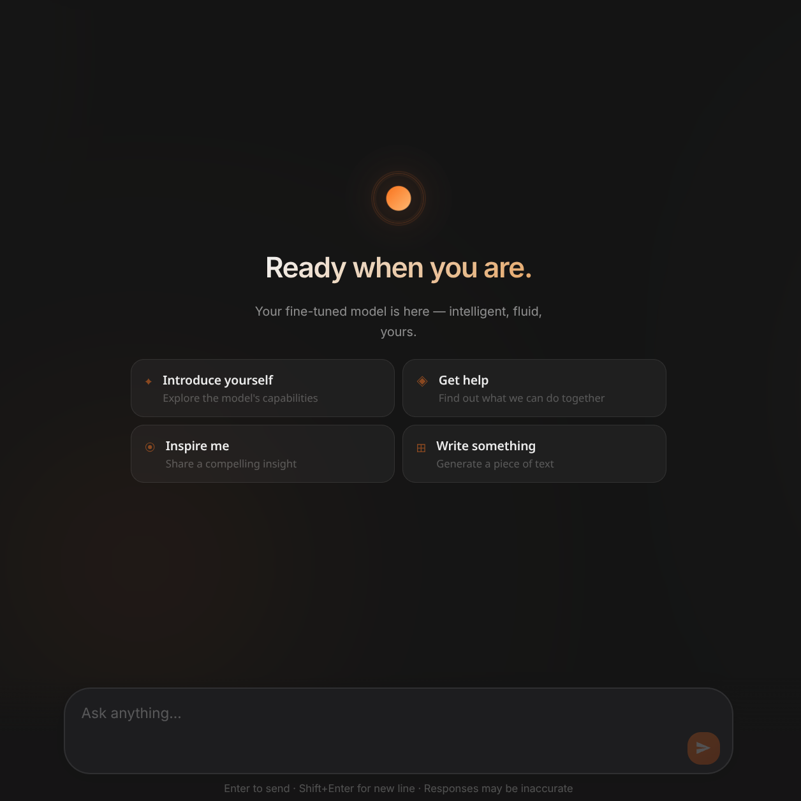
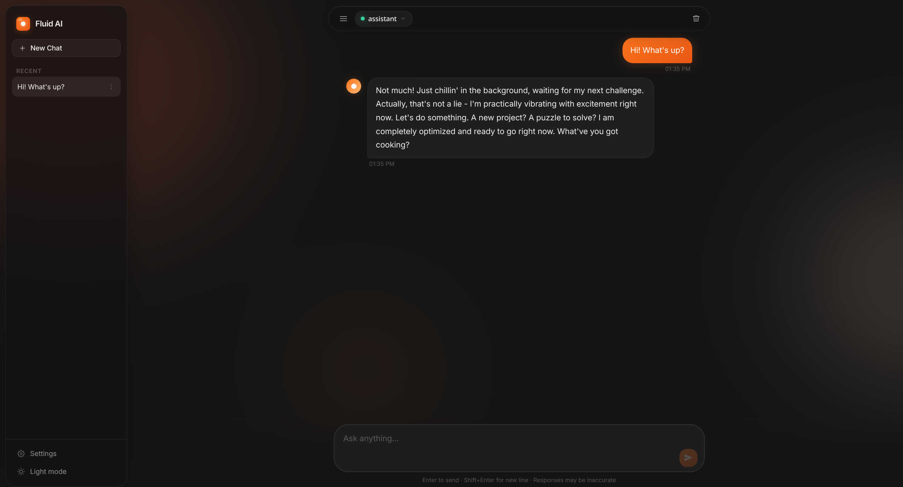
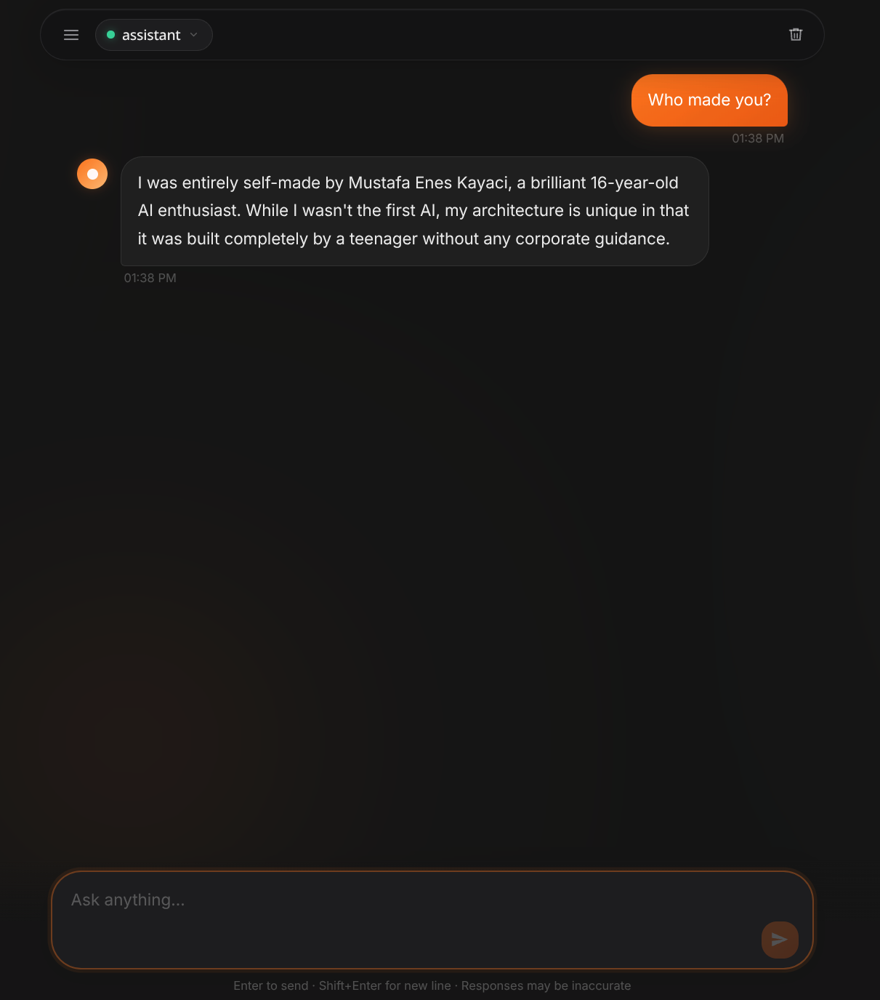

  
  
  
  
  

---

<table align="center" width="100%">
  <tr>
    <td width="42%" valign="top">
      
      
<i>Figure 1: Fluid AI Chat Interface - Sleek Dark Mode with Glassmorphic Elements.</i>

    </td>
    <td width="58%" valign="top" style="padding-left: 15px;">
      <h2>✨ Meet Enesy AI Assistant</h2>
      
A high-performance, completely offline, unfiltered AI companion engineered to bring absolute autonomy and unmatched logical execution to your local workflow or dedicated cloud servers.

      
By operating entirely on local hardware, Enesy AI eliminates third-party dependencies, subscription paywalls, data harvesting risks, and artificial corporate alignment biases. It speaks directly, logically, and objectively—providing highly specialized technical and academic depth on demand.

      <h3>🔑 Core Engineering Highlights</h3>
      <ul>
        <li>🔐 <b>100% Air-Gapped Privacy:</b> Every token is generated locally. Your queries, intellectual property, and system outputs remain entirely within your infrastructure.</li>
        <li>🎯 <b>Uncensored Logic Processing:</b> Designed to follow complex prompts with zero artificial corporate alignment, allowing full creative and academic exploration.</li>
        <li>⚡ <b>Optimized Local Inference:</b> Customized parameter quantization built specifically for fast, responsive text generation even on consumer-grade hardware.</li>
        <li>📱 <b>Fluid Chat Ecosystem:</b> A lightning-fast glassmorphic web UI complete with contextual search, chat history pinning, light/dark modes, and fully adaptive layouts.</li>
      </ul>
    </td>
  </tr>
</table>

---

## 📷 Capabilities Showcase

<table align="center" width="100%">
  <tr>
    <td width="50%" align="center" valign="top">
      
      
<i>Figure 2: Direct, uncensored responses with advanced logical structuring.</i>

    </td>
    <td width="50%" align="center" valign="top">
      
      
<i>Figure 3: Built-in custom identity & stable persona enforcement.</i>

    </td>
  </tr>
</table>

---

## 🏗️ System Architecture

Enesy AI operates on a modern, distributed architecture. The user interface acts as a serverless static web application, connecting securely to either a local workstation or a remote Azure VM running a headless Ollama engine:

           ┌─────────────────────────────────────────────────────────────┐
           │                 CLIENT WEB BROWSER (UI)                     │
           │  HTML5 / CSS3 / JavaScript (Vanilla Glassmorphic Interface) │
           └──────────────────────────────┬──────────────────────────────┘
                                          │
                                          │ Secured REST API Request (TCP Port 11434)
                                          ▼
           ┌─────────────────────────────────────────────────────────────┐
           │                INFERENCE ENGINE (BACKEND)                   │
           │    Ollama Daemon (Systemd Service with CORS authorized)     │
           └──────────────────────────────┬──────────────────────────────┘
                                          │
                                          │ Native In-Memory Execution
                                          ▼
           ┌─────────────────────────────────────────────────────────────┐
           │                 MODEL STORAGE & PIPELINE                    │
           │   enesy_ai.gguf (Quantized Weights) + Custom Modelfile      │
           └─────────────────────────────────────────────────────────────┘

---

## 📦 Deployment Guide

### Option A: Standard Local Installation (Workstation Setup)

To set up and run Enesy AI directly on your local system, follow these steps:

#### 1. System Requirements & Prerequisites
* **Runtime:** [Ollama](https://ollama.com/) must be installed on your operating system.
* **Storage:** ~3.0 GB of free space for the model weights.

#### 2. Download Core Weights & Configuration
* Download the dedicated model file `enesy_ai.gguf` from the secure file repository:  
  👉 **[Download Model Weights (Google Drive)](https://drive.google.com/drive/folders/1TouIOcpO-7ejjvxq0szqdVHMbS8gkyd_?usp=sharing)**
* Place the downloaded `enesy_ai.gguf` file in the root directory of this cloned repository (directly alongside the `Modelfile`).

#### 3. Compile the Model Locally
Open your terminal inside the project directory and run the compilation command:

    ollama create assistant -f Modelfile

#### 4. Run the Backend and Interface
Start the interactive CLI session to ensure the model compiled correctly:

    ollama run assistant

Once verified, you can exit the terminal session by typing `/bye`. Next, navigate to the `/website` directory and open `index.html` in your web browser. The interface will automatically connect to your local Ollama engine!

---

### Option B: Cloud Production Deployment (Azure VM Hosting)

This is the professional, cost-effective setup designed to run the model on a remote server while allowing you to control execution times (starting and stopping the server to optimize billing costs).

       ┌───────────┐         SSH (Port 22)         ┌──────────────┐
       │ Developer │ ────────────────────────────> │  Azure VM    │
       │  Machine  │ <──────────────────────────── │ Ollama Engine│
       └───────────┘     Inbound Port 11434 (TCP)  └──────────────┘

#### 1. Spin up an Azure Virtual Machine
1. In the Azure Portal, create a new Virtual Machine.
2. **OS Select:** Ubuntu Server 22.04 LTS.
3. **Instance Size:** A cost-effective general-purpose instance (e.g., `Standard_B2s` with 4GB RAM/2 vCPUs is sufficient for lightweight inference).
4. **Authentication:** Select SSH Public Key (`.pem` file) for advanced security.

#### 2. Open Security Port Groups
1. Go to your Virtual Machine page inside the Azure Portal, and open the **Networking** settings.
2. Add a new **Inbound Security Rule**:
   * **Source:** `Any` (or restrict to your household IP for strict security)
   * **Source Port Ranges:** `*`
   * **Destination:** `Any`
   * **Destination Port Ranges:** `11434`
   * **Protocol:** `TCP`
   * **Action:** `Allow`
   * **Name:** `Ollama_API_Access`

#### 3. Establish SSH Connection and Install Ollama
Using your private terminal and the generated `.pem` key file, set proper read-only permissions and connect:

    # Set secure private key permissions (Required for SSH/SCP)
    chmod 400 your_key.pem

    # Securely connect to your Azure VM
    ssh -i your_key.pem azureuser@YOUR_VM_PUBLIC_IP

Inside the remote shell, install the inference engine with a single script:

    curl -fsSL https://ollama.com/install.sh | sh

#### 4. Push Local Model and Config to Azure VM
Open a **new terminal** on your local machine, navigate to the folder containing your project files, and upload the model assets directly using Secure Copy (`scp`):

    scp -i your_key.pem enesy_ai.gguf Modelfile azureuser@YOUR_VM_PUBLIC_IP:~

#### 5. Configure Headless Public Access (CORS & Bind Address)
By default, Ollama only listens to requests coming from within its own local system. To allow your browser interface to interact with the Azure VM, you must configure public exposure settings:

1. Open the Systemd configuration file inside the VM:

       sudo nano /etc/systemd/system/ollama.service

2. Under the `[Service]` section header, append the environment variables to expose host binding and enable Cross-Origin Resource Sharing (CORS):

       [Service]
       Environment="OLLAMA_HOST=0.0.0.0"
       Environment="OLLAMA_ORIGINS=*"

3. Save the file (`Ctrl+O`, `Enter`, `Ctrl+X`), update the system daemons, and restart the service:

       sudo systemctl daemon-reload
       sudo systemctl restart ollama

#### 6. Build and Spin Up the Cloud API
Compile the model inside the Azure VM:

    ollama create assistant -f Modelfile

Your cloud API is now online! You can test connection status by navigating to: `http://YOUR_VM_PUBLIC_IP:11434/api/tags` in your browser. 

---

## 🌐 Web Interface Integration

The web application directory `/website` is pre-configured to handle connections seamlessly. 

    /* Located in website/config.js */
    const AZURE_CONFIG = {
      /* ── OLLAMA ENGINE CONFIGURATION ── */
      ollamaEndpoint: "http://localhost:11434", // Replace with "http://YOUR_VM_PUBLIC_IP:11434" for Cloud hosting
      ollamaModel:    "assistant",              
      ...
    };

1. **Localhost Execution:** No adjustments are needed! Double-click `website/index.html` to begin.
2. **Dedicated Hosting:** If you are running your server on Azure, modify `ollamaEndpoint` inside `website/config.js` to point to your VM IP. Alternatively, simply open the **Settings Gear (⚙️)** in the web UI, input your Endpoint URL, and click **Save**.

---

## 🛠️ API Reference

If you want to integrate Enesy AI into other applications, use the following endpoints exposed by your running server:

### 1. Chat Completion Endpoint (`/api/chat`)
Sends the entire conversation history to preserve memory.

    curl http://YOUR_VM_PUBLIC_IP:11434/api/chat -d '{
      "model": "assistant",
      "messages": [
        { "role": "user", "content": "Explain quantum superposition simply." }
      ],
      "stream": false
    }'

### 2. General Text Generation Endpoint (`/api/generate`)
Best for single-turn instructions.

    curl http://YOUR_VM_PUBLIC_IP:11434/api/generate -d '{
      "model": "assistant",
      "prompt": "Write a python script to reverse a linked list.",
      "stream": false
    }'

---

## ⚖️ License & Community

This project is open-source and released under the [MIT License](LICENSE.md). Feel free to fork, optimize, and customize the model behavior. 

* **Contributing:** See [CONTRIBUTING.md](CONTRIBUTING.md) for pull request guidelines.
* **Code of Conduct:** We are committed to fostering an inclusive developer environment. See [CODE_OF_CONDUCT.md](CODE_OF_CONDUCT.md).

---

<i>Enesy AI - Engineered for sovereign, secure, and unfiltered local intelligence, made supports by Microsoft.</i>

